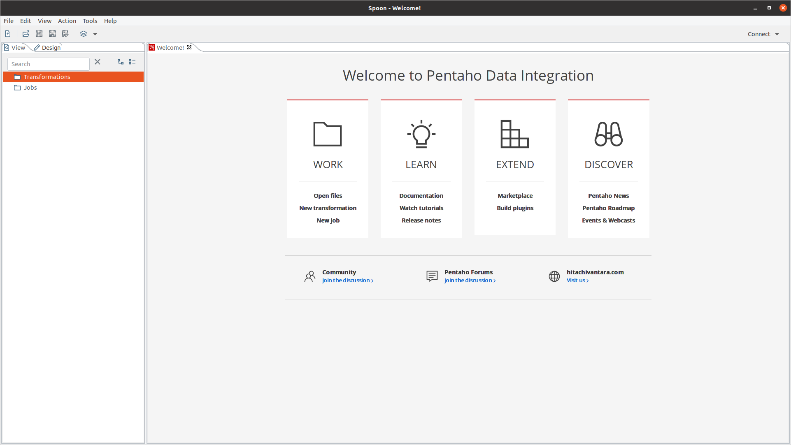

# Pentaho Data Integration - Kettle

## 0. Thiết lập trước cài đặt
- Pentaho Data Integration version: 9.1
- Java 8 (JRE + JAVA_HOME path)
## 1. Hướng dẫn cài đặt
### 1.1. Windows
- Truy cập trình duyệt và tải về qua trang sau: [pentaho-download](https://sourceforge.net/projects/pentaho/files/) chọn version 9.1
- Giải nén file download `pdi-ce-9.1.0.0-324.zip`.
- cd vào folder `data-integration`
### 1.2. Linux
- Truy cập trình duyệt và tải về qua trang sau: [pentaho-download](https://sourceforge.net/projects/pentaho/files/) chọn version 9.1
- Giải nén file download `pdi-ce-9.1.0.0-324.zip`.
- cd vào folder `data-integration`
- Chạy file `spoon.sh`, giao diện hiển thị ra như sau: 

- Đến bước này, về cơ bản pentaho pdi client thành công. 
##### 1.2.2. Fix lỗi libwebgtk-1.0-0 trên Ubuntu 20.04 LTS
Thanks [issues](https://github.com/subgraph/Vega/issues/177) for fixing it! It works.

- Mở Terminal và chỉnh sửa file sau (quyền sudo):
```bash
sudo vim /etc/apt/sources.list
```
- Thêm entry vào file và lưu lại:
```bash
deb http://cz.archive.ubuntu.com/ubuntu bionic main universe
```
- Chạy câu lệnh cập nhật source list:
```bash
sudo apt-get update
```
- Cài đặt `libwebkitgtk-1.0-0` qua apt:
```bash
sudo apt-get install libwebkitgtk-1.0-0 
```